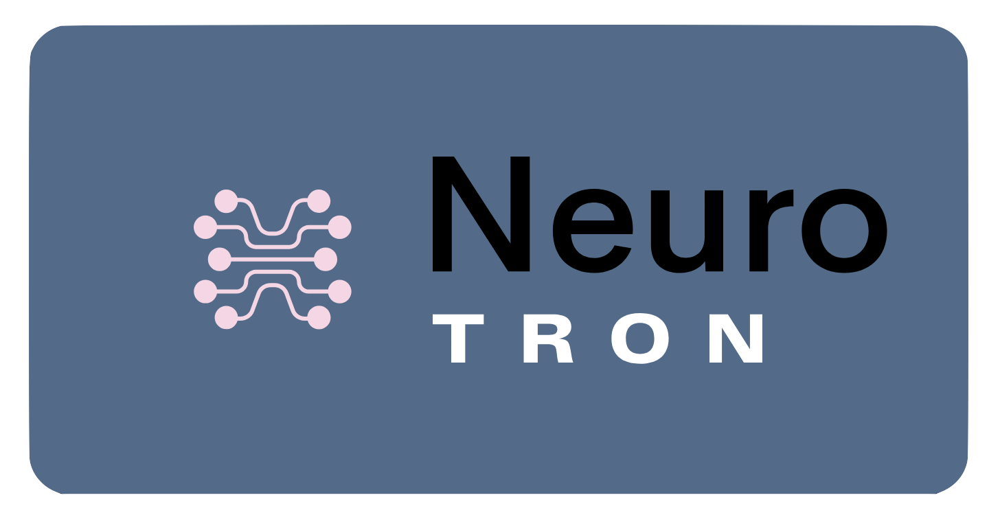

The goal of this project is to use deep learning to build a model that can predict the position of the hand in 21 points from 8 channels of microvoltage data from a surface electromyography device. This data will be collected across bluetooth from a small peripheral, used to generate a prediction of hand position and then rendered on a display.

This model is trained by collecting microvoltage from an arm band peripheral to be used as feature data. Positional data is collected using a Leap camera and used as truthy label data. A model is then trained to correlate this position and emg data to allow predictions of hand position to be made from only emg data.

This problem has applications in VR/AR for gaming and productivity in many industries, Computer-Neural interfacing, Next-Gen prosthetics.

## Hardware
This project is using a Thalmic Labs Myo EMG armband for microvoltage data and a Leap Motion Controller for label data.

See the data acquisition section for more details: [here](data_acquisition)

## Data
The EMG data has 8 channels correlating with microvoltage at each of the 8 panels of the Myo Armband.

The Leap motion returns a complex 'hand' object for which 63 values are extracted. These represent the x,y,z coordinates of 21 points on the hand in mm.

```
		'Wrist x', 'Wrist y', 'Wrist z',
		'Thumb Proximal x', 'Thumb Proximal y', 'Thumb Proximal z',
		'Thumb Intermediate x', 'Thumb Intermediate y', 'Thumb Intermediate z',
		'Thumb Distal x', 'Thumb Distal y', 'Thumb Distal z',
		'Thumb Tip x', 'Thumb Tip y', 'Thumb Tip z',
		'Index Proximal x', 'Index Proximal y', 'Index Proximal z',
		'Index Intermediate x', 'Index Intermediate y', 'Index Intermediate z',
		'Index Distal x', 'Index Distal y', 'Index Distal z',
		'Index Tip x', 'Index Tip y', 'Index Tip z',
		'Middle Proximal x', 'Middle Proximal y', 'Middle Proximal z',
		'Middle Intermediate x', 'Middle Intermediate y', 'Middle Intermediate z',
		'Middle Distal x', 'Middle Distal y', 'Middle Distal z',
		'Middle Tip x', 'Middle Tip y', 'Middle Tip z',
		'Ring Proximal x', 'Ring Proximal y', 'Ring Proximal z',
		'Ring Intermediate x', 'Ring Intermediate y', 'Ring Intermediate z',
		'Ring Distal x', 'Ring Distal y', 'Ring Distal z',
		'Ring Tip x', 'Ring Tip y', 'Ring Tip z',
		'Pinky Proximal x', 'Pinky Proximal y', 'Pinky Proximal z',
		'Pinky Intermediate x', 'Pinky Intermediate y', 'Pinky Intermediate z',
		'Pinky Distal x', 'Pinky Distal y', 'Pinky Distal z',
		'Pinky Tip x', 'Pinky Tip y', 'Pinky Tip z'
```

EMG and Position data are collected together and bundled into a single csv which is used for training. Data was collected as 30 minute sets, but some aggregate sets were build from multiple 30 minute sets.
The resulting csv file contains columns for EMG, system, and leap timestamps, the 8 EMG channels, and the above hand position data.

Again, see the data acquisition section for more details: [here](./data_acquisition)

## Machine Learning
To train the data is overlapped into sequences of 32 sets of 8 channels of EMG datapoints coordinating to each training hand position. This means that a sequence of 32 EMG readings across the last roughly 0.5 seconds are correlated to the current hand position.

During prediction the last 32 emg readings are cached and used to predict the current hand position.

The ML architecture uses 3 layers of LSTM containing between 256 and 128 Neurons to process the sequence of 32 EMG readings. This segment outputs a vector of 128 values corellating to an abstract state representation. This vector is then fed into a several fully connected layers of between 256 and 512 neurons to correlate this abstract LSTM vector to a vector of the 63 hand position values.

Tensorflow 2.0 and keras are used to build and train the networks.

See the ml section for more info on the model architecture [here](./ml).

This section contains jupyter notebooks following the different iterations of the networks:
[Model Pipeline Notebook](./ml/primary_model_pipeline.ipynb)

And training and loss/error statistics on the final network:
[Large Dataset Training Notebook](./ml/Large_dataset_build_model_all_joints.ipynb)

## Application
A demo application is included that will load a model, connect to the Myo over bluetooth, make predictions and stream them to a godot rendering engine for visualization.

This setup has only been tested on Debian and Ubuntu family linux distros.
The test setup used Bluez v5.51, python 3.7, and Tensorflow 2.0.0

See the [application](./app) for more info on running the app.

See [gt_rendering](./gt_rendering) for info on starting the Godot server

## Results

## Future Improvements
In its current configuration the Myo armband is capable of generating ~50Hz sample rate. Current studies suggest a bulk of Neuronal EMG data is operating around 20hz - 500hz. Our current hypothesis is that increased fidelity could be achieved in the model if EMG readings could be pushed closer to 1000hz to allow unaliased signals in this range to be captured.

Additionally we would like to explore using convolutions on the LSTM output to attempt a deeper more effective correlation layer.

Recent Transformers and Self Attention methods could also provide improvements.

## Project Contributors
Jose Cruz y Celis
Jackson Beall
Thomas Holzheu

## Resources

