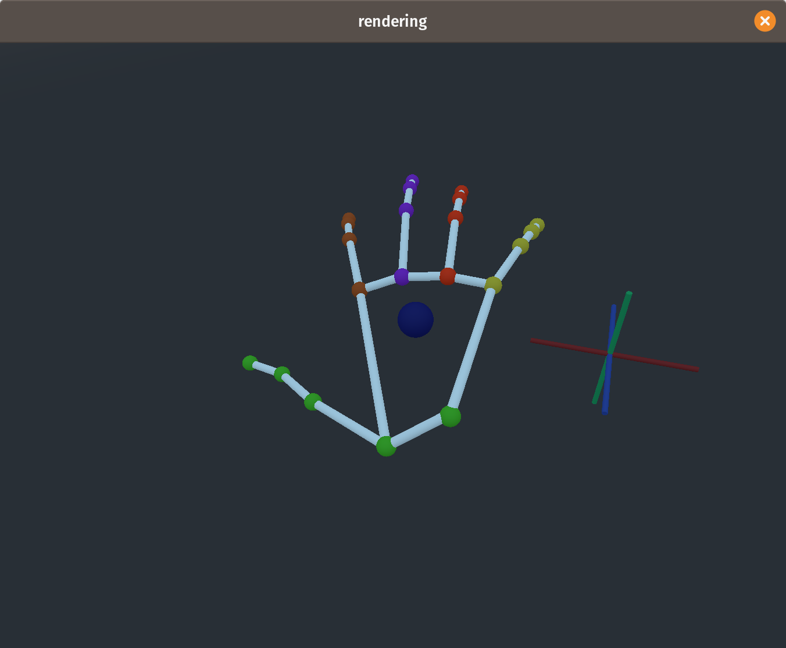
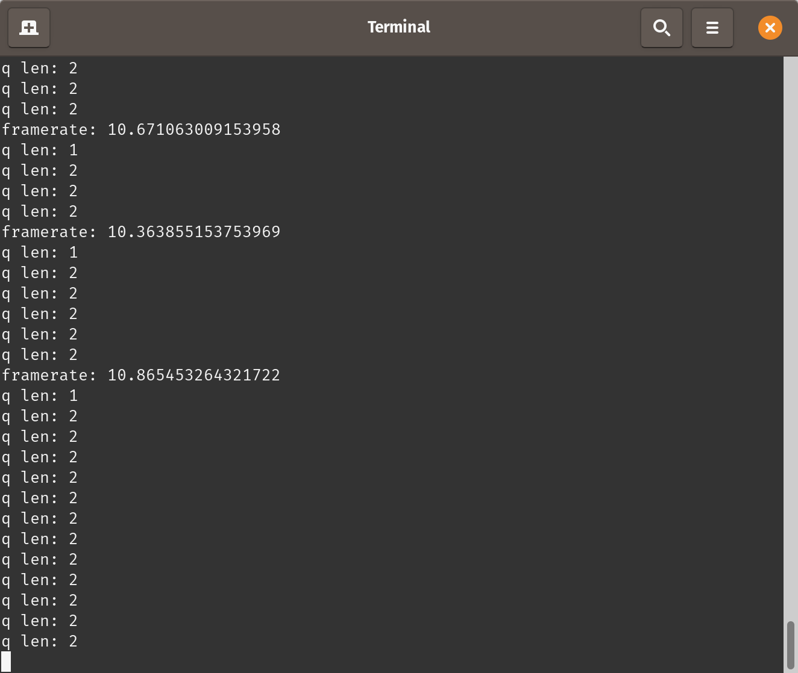

# App
This application will connect to the Myo surface electromyography peripheral via bluetooth, load a previously built keras ML model,
gather data in real time, process the data into a meaningful shape and perform hand position calculations with the neural net from the 8 emg channels and then attempt to broadcast the hand position data to a running godot instance for visualization.
Predictions will be done and sent to godot as fast as can be computed, up to 50 fps (limited by the myo sample rate).

Bluetooth connection is automatically managed and will be reestablished if disconnected.

See the gt_rendering folder for more info on the godot instance.

There are two executable applications in this directory. The first is the `app.py` which will perform the full task described above, the second is the render_from_data.py script. This script is given a 'stitched' data file with both the 8 channels of emg data and the leap position and will transmit either the label data or predictions from the emg data to a godot instance. The purpose of this is essentially playback of datasets used for model training.

<p float="left">
  
  
</p>

## Requirements
Both of these apps have only been tested on Linux 4 and 5 kernels and may work on MacOS but will almost certainly require some bluetooth configuration adjustments.

* godot (see gt_rendering)
* python 3.7 and up
* Tensorflow 2.0.0
* bluepy
* pandas
* numpy

## `app.py`
This is the main application for connecting to the myo, performing predictions and visualizing the results.

## Setup
`pip3 install -r requirements.txt`

### usage
```
usage: app.py [-h] [--model MODEL] [--seq SEQ]

optional arguments:
 -h, --help
 --model MODEL, -m MODEL    specify a ml model to use
 --seq SEQ, -s SEQ          specify model sequence length
 ```

 The sequence length refers the number of emg frames to package into each prediction item. This has to match the sequence size from the LSTMs in the model being used.

## `render_from_data.py`
This application is used for streaming saved datasets. Predictions can be done in this manner without a myo, or leap labeling data can be visualized.

### usage
```
usage: render_from_data.py [-h] [--predict] [--model MODEL] data

positional arguments:
 data_set

optional arguments:
 -h, --help
 --predict, -p           specifies whether leap or myo data is used
 --model MODEL, -m MODEL
 ```

## Application Components
This application consists of modules to read myo data through bluetooth, perform ML tasks, and stream to a godot instance. These components are very modular and easy to repurpose.

### ML
The ML Core can be used to train models from data, load already trained models, make predictions on custom sequences of data, or automatically build sequences from a stream of single data sEMG datum.
```python
from src.neuro_ml import NeuroML

ml = NeuroML()
ml.load_model(model_file)  						# load a saved model
ml.build_model(joint_data_set, sequence_length) # train a model from data

ml.predict(data)	# push data to the queue and predict at the correct sequence lengths
ml.predict_sequence(sequence) # predict on a custom formed sequence
```

The `neuro_ml.py` module can be run directly to train a model from a joined data file.

`./neuro_ml.py joined_data_set.csv`

### MyoBT
This modules can be used to maintain a connection to the myo and register handlers to asychronously process myo data as it becomes available.

```python
from src.myo_core import MyoBT

def handler(myo, emg):
	do_stuff_with_data(emg)
	interact_with_myo(myo)

myo = MyoBT()
myo.assign_emg_handler(handler)
myo.run()
```

### Godot
This module streams data to a godot instance. The `gt_module.py` file can be edited to configure the godot network configuration.

```python
import src.gt_module as gt_module

gt_module.send_to_godot(data)
```
